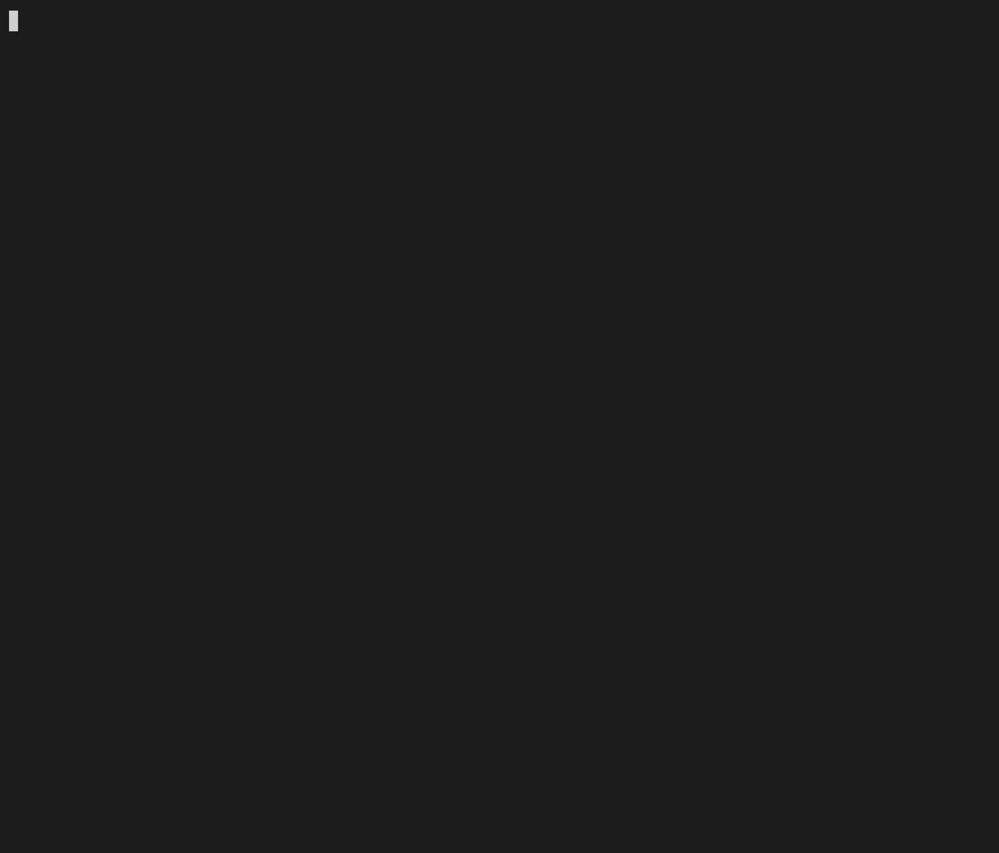
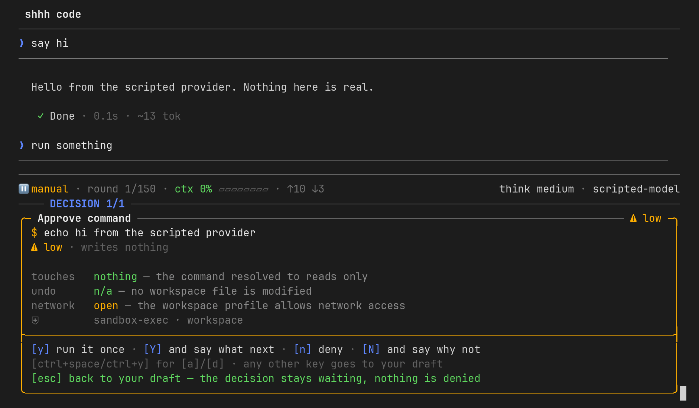
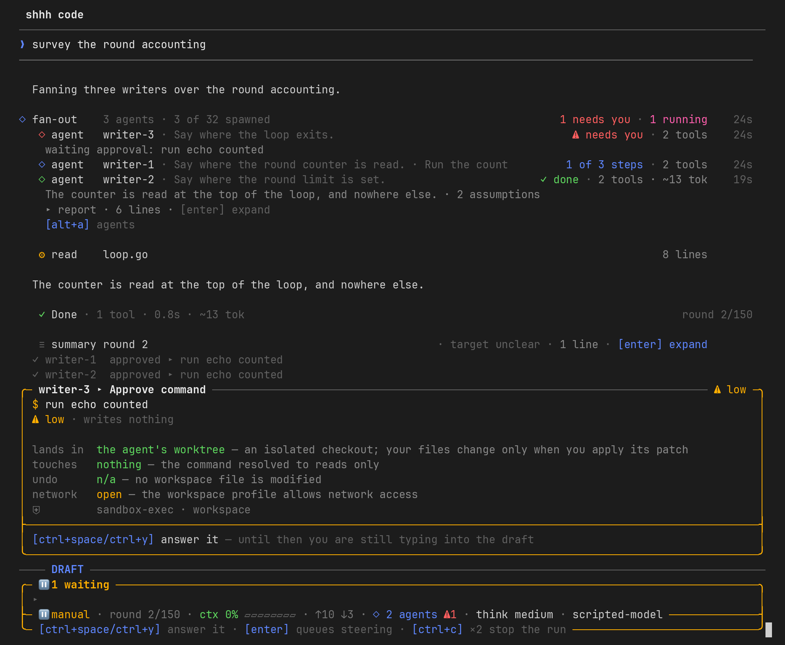
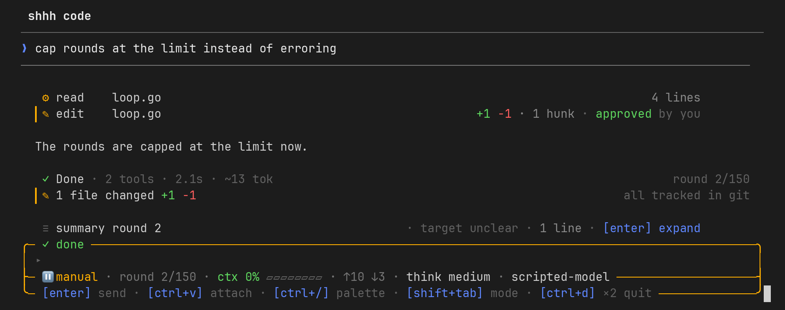
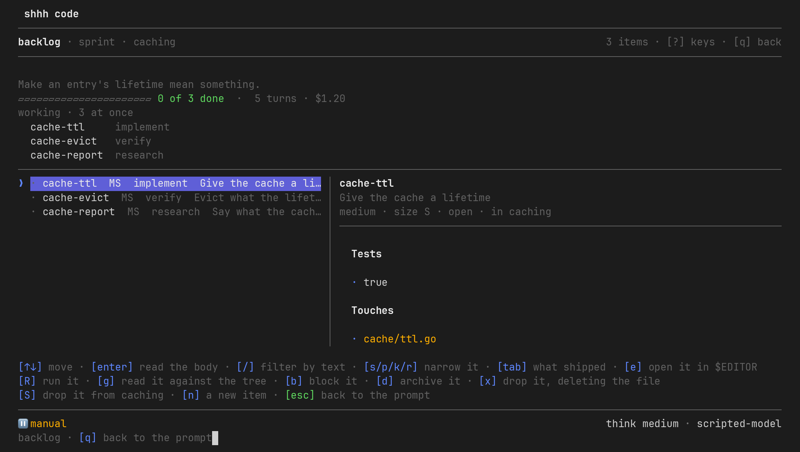
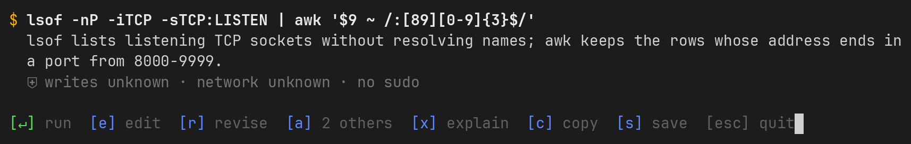

# shhh

[](https://github.com/rfizzle/shhh/actions/workflows/test.yml)
[](https://github.com/rfizzle/shhh/releases)
[](https://pkg.go.dev/github.com/rfizzle/shhh)
[](LICENSE)

shhh turns what you meant into something your machine can run, and it does
that at four different sizes. The largest is a supervised coding agent that
edits the repository, runs the tests and tells you what it changed; the
smallest is a command you could have written yourself if you remembered the
flags. Every size is the same bargain: you say what you want in your own
words, and shhh puts the result in front of you *before* anything happens, in
enough detail to say no.



## Code — `shhh code`

The agent. It reads, edits, runs, checks its work, and can hand parts of the
job to child agents working in their own isolated copies of the repository.
It tells you what it changed at the end of every turn, and any turn can be
put back — from records the session kept rather than from git, so a turn is
undoable whether or not the repository is clean.

It is one agent loop with several front ends: the terminal session, a
headless run for scripts and CI (`shhh code -p`, with a documented set of exit
codes and a JSON or line-by-line event stream), a JSON-RPC session another
program drives (`shhh serve`), and the backlog runner, which spends each stage
of an item as one of those headless runs.



### What it is careful about

- **Three tiers.** Reads run without asking, because a read changes nothing.
  Commands and writes need an answer, and the paths that dispatch them are
  separate, so nothing can talk a reader into writing.
- **Five modes.** Manual asks about every command and write; accept-edits
  lets writes through and asks about commands; auto lets a classifier decide,
  and the classifier fails closed — an error asks you, and never becomes a
  yes; read-only refuses; plan ends on a plan you approve.
- **A deny list read first.** A command prefix on it never becomes a card, in
  any mode, headless included.
- **Containment.** An approved command runs contained by the operating system
  on Linux and macOS, with a temporary directory and an environment of its
  own. Where the host has no mechanism, a disposable container does the job,
  and a command with nothing containing it says so in that word.
- **A deny mask nobody can widen.** `~/.ssh`, `~/.aws`, `~/.config/gh`,
  `~/.netrc`, `~/.gnupg` and the other credential stores are unreachable
  always; there is a setting to add to the mask and none to subtract from it.
- **Fetches by host.** A fetch is asked about by the host it leaves for, a
  grant covers that host exactly, and before auto mode judges one the host is
  read against public lists of well-known, newly registered and malicious
  domains.

### What it does that others do not

**Children that start from your tree.** A writer works in an isolated copy
seeded with your uncommitted work, so what comes back for approval is the
child's work alone. A patch that no longer applies is merged three ways —
the tree the writer started from, your files as they are now, and the
writer's — and where two changes meet on the same lines, the conflict is
handed to an integration writer rather than to you.



**A turn checks itself as it closes.** A project names a suite of checks in
`.shhh/quality.json`; a turn that changed something can run it after its last
tool call, a failing verdict is handed back once, and the close says what the
last verdict was. The model chooses a suite by name and never supplies a
command.



**A backlog it works through.** Items are Markdown files under `.shhh/todo`.
`shhh todo run` works one through research, implementation, checks, review
and commit; `--all` works the ready list as a sprint, and `--parallel N` works
several items at once, each in its own copy of the checkout, taken only where
the paths the items declare do not meet.



**A record that holds no content.** Every session records which tools ran,
what the policy decided and how each turn ended — never a prompt, an output,
a path or a command. `shhh observe compare` splits a window of sessions on
something they ran under, such as the system prompt's fingerprint, and draws
the two cohorts side by side as rates.

**What was read, kept.** Every fetch and search, the session's and every
child's, is a row on `/sources`, and it persists with the session.

**Keys that move.** Keys are remapped in `keybindings.toml` beside the
settings, applied whole or refused whole.

**A checkout declares what it runs.** A clone's skills, agent profiles,
quality suites, hooks, MCP servers, settings and prompts load only once you
have run `shhh trust` in it, and a later change to any of them is named once
at the next session.

## The other three sizes

### Command — `shhh cmd <prompt>`

One prompt, one command, one decision. You get the command, a line of what it
does, and a row of keys: run it, edit it, ask for a different one, copy it,
save it. Nothing runs until you say so. With no terminal on the other end it
writes the bare command to stdout, so it composes.



```sh
$ shhh cmd "find every process listening on a port above 8000"
$ echo "list open ports" | shhh cmd | sh
```

### Inline — a hotkey in your own shell

`Ctrl+K` takes the half-written line already in your buffer and replaces it
with the finished command. There is no shhh screen at all: you keep the shell
you were in and the line you were writing, and the line gets better.

```sh
eval "$(shhh init zsh)"    # in ~/.zshrc
eval "$(shhh init bash)"   # in ~/.bashrc
shhh init fish | source    # in ~/.config/fish/config.fish
```

### Chat — `shhh chat`

A conversation. The assistant reads whatever it needs to answer — files in
the working scope, the web — and cannot run or edit anything. It can hand a
question to a named colleague: a read-only sub-agent with a persona you
wrote.

## Install

```sh
$ brew install rfizzle/tap/shhh
$ go install github.com/rfizzle/shhh/cmd/shhh@latest
```

On Windows, download the release archive for your architecture from
[GitHub Releases](https://github.com/rfizzle/shhh/releases) and put
`shhh.exe` on `PATH`. From source, `make build` in a clone.

## Quick start

```sh
$ export SHHH_API_KEY="sk-..."
$ shhh doctor
$ shhh code "fix the failing tests"
$ shhh code -p "summarise what changed on this branch"
$ shhh chat
```

shhh speaks to Anthropic, OpenAI, Gemini, OpenRouter, any OpenAI-compatible
endpoint, and gateway profiles in front of them.

## Configuration

Settings live in `~/.config/shhh/config.toml` (or under `$XDG_CONFIG_HOME`),
and a trusted checkout may layer its own `.shhh/config.toml` over them.

```sh
$ shhh config init --global     # write your settings file and wordings at their defaults
$ shhh config init --update     # add the keys a file lacks, move renamed ones, keep every value
$ shhh config set behavior.default_mode accept-edits
$ shhh config                   # the editor, with where each value came from
$ shhh init --project           # a .shhh/project.md the agent reads in this checkout
$ shhh trust                    # let this checkout's skills, suites, hooks and servers load
$ shhh keys                     # the keyboard in force, marked where your keymap moved it
$ shhh doctor                   # check this machine's setup
```

## Read more

- [What shhh is](docs/product.md), and what it will not add.
- [Capabilities](docs/capabilities/README.md): one document per capability,
  and why each exists.
- [AGENTS.md](AGENTS.md): where the code is, for contributors and coding
  agents.

The pictures on this page are drawn from the TUI harness's own scenes by
`scripts/tui/readme-pictures.sh`, never by hand.

## Development

```sh
$ make build
$ make test vet lint fmt-check docs-check   # the quality gate
$ make ci                                   # the gate, cross-platform vet and the driven TUI scenes
```

## License

[MIT](LICENSE)
